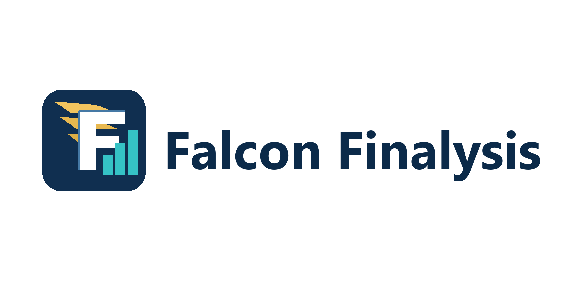
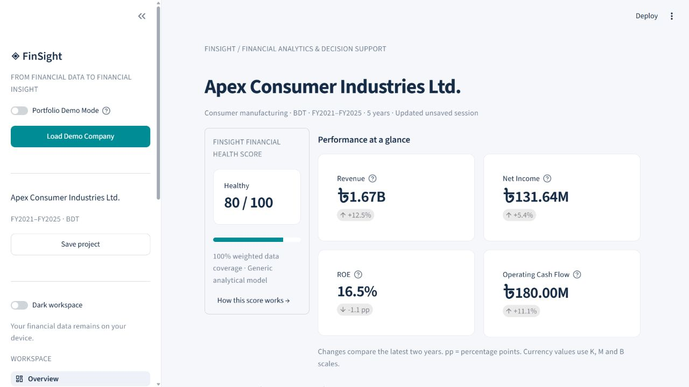
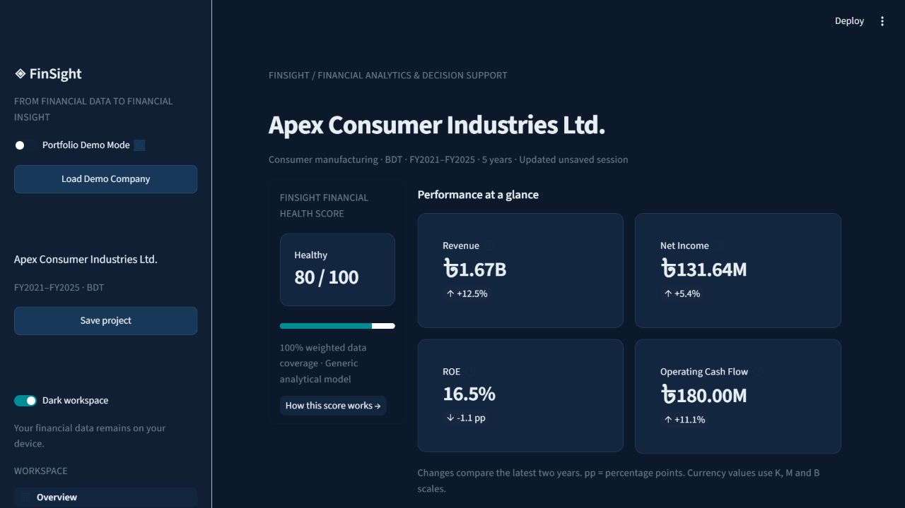

# Falcon Finalysis

### Financial Analytics & Decision Support Platform

**From Financial Data to Financial Insight**



A local-first Python application that turns annual financial statements into ratios,
cash-cycle analysis, explainable signals, operating scenarios and executive reports.
Built for analysts, finance students and SME decision-makers who need to investigate
performance without connecting company data to an external service.

> Demo: **Apex Consumer Industries Ltd.**, a fictional manufacturer with five
> reconciled fiscal years (2021–2025). No actual company financial data is included.

## Quick start

Requires **Python 3.11 or newer**. Run these commands inside the `finsight` directory:

```powershell
python -m venv .venv
.venv\Scripts\python -m pip install -r requirements.txt
.venv\Scripts\python -m streamlit run app.py
```

On macOS/Linux, replace `.venv\Scripts\python` with `.venv/bin/python`.
If Windows provides `py` instead of `python`, use `py -3 -m venv .venv` for the first command.
After installation, `start.ps1` is a convenience launcher on Windows.

Open **http://127.0.0.1:8501**, then choose **Load Demo Company** or enable
**Portfolio Demo Mode**. No API keys, subscriptions or paid services are required.
Package installation and optional live DSE/CSE lookup require internet access; uploaded
statements, calculations, projects and reports stay on the local computer.

## Project overview

### Why I built Falcon Finalysis

The project explores how financial analysis and software engineering can work
together: preserve accounting meaning, make calculations inspectable, and give
users useful questions to investigate rather than unsupported conclusions.
Personalize this motivation and the author section before publishing your portfolio.

### Problem

Financial statements are rich in information, but analysts often spend time
repeating formula work, checking inconsistent inputs and assembling reports.
Standalone calculators rarely connect profitability, funding and cash conversion.

### Solution

Falcon Finalysis provides a single local workflow:

**Raw financial data → structured information → financial analysis → business insight → decision support.**

It pairs numerical results with formulas, missing-data reasons, multi-year context,
strengths, risks and analytical questions. Generic rules are transparent and editable.

## Features

| Area | V1 capability |
|---|---|
| Input | Values-only XLSX/CSV mapping, statement-style Excel, review-first annual-report PDF extraction, manual editor, guided template with field definitions |
| Listed companies | Official DSE/CSE company details, ticker list, annual reported metrics, conservative template prefill, date-range price history, upload fallback and managed Excel export |
| Data Quality Center | Readiness score, period continuity, unusual-value review, reconciliation findings, field coverage, provenance coverage and remediation queue |
| Portfolio management | Saved multi-stock workspaces, holdings and fees, dividends/rights/splits, benchmark comparison, return, volatility, Sharpe/Sortino, drawdown, VaR, covariance, risk contribution and reviewable rebalancing |
| Valuation Lab | Selected-company WACC, ROIC/reinvestment history, five-year FCFF DCF, value-per-share sensitivity, trading-comps ranges and football-field summary |
| Industry comparison | Anchor-company workflow, packaged same-industry suggestions, two-to-eight ticker comparison, aligned exchange metrics and up to 20 uploaded full statements |
| CredGrid AI | Consent-gated CSV/XLSX/PDF transaction review, category suggestions, evidence indicators, versioned pilot scorecard, affordability, benchmark-linked pricing, reason codes and human decision audit |
| Local governance | Pilot settings, deployment-readiness checklist, append-only activity history and local database backup |
| Data quality | 3–10 consecutive full fiscal years, numeric and duplicate checks, accounting reconciliations, configurable tolerance |
| Data readiness | Analysis-by-analysis availability, field completion, missing-input guidance and recorded source coverage |
| Dashboard | Company metadata, 12+ metrics, deltas, health dimensions, interactive revenue/profit/cash and score-history charts |
| Ratios | Liquidity, profitability, efficiency, leverage, cash flow and optional per-share/market measures |
| Statements | Reported tables, base-year horizontal analysis and common-size income/balance analysis |
| DuPont | Three-factor decomposition and exact symmetric attribution of ROE change |
| Trends | YoY growth, CAGR, three-observation direction and volatility |
| Insights | Rule-based executive summary, strengths, risk severity, evidence and questions to investigate |
| Health | 0–100 Falcon Finalysis score, category weights, thresholds, coverage and methodological limitations |
| Scenarios | Ten operating assumptions, base/scenario comparison, six-driver sensitivity and tornado chart |
| Peers | Up to 20 manually uploaded competitors, same-year ratio comparison without an overall ranking |
| Projects | SQLite create/save/open/duplicate/rename/delete, stored scenario assumptions and report-generation history |
| Reporting | Paginated PDF with vector charts and source appendix; Excel snapshots with cell provenance |
| Presentation | Navy/teal workspace, optional dark workspace, first-session decision notice, portfolio demo and About page |

## Demo workflow

1. Start the application and select **Load Demo Company**.
2. Overview displays Apex, FY2021–FY2025, the financial health score and key metrics.
3. Open **Ratio Analysis** to inspect formulas, trends and explanations.
4. Open **DuPont Analysis** and **Working Capital** to connect returns with operations.
5. Open **Key Insights & Risk Flags** and inspect both strengths and concerns.
6. In **Scenario Lab**, change **Revenue Growth %** from 0 to **15**.
7. Review projected earnings and cash-flow proxies, then test sensitivity.
8. Choose **Save project**; save a named scenario if desired.
9. Open **Generated Report**, generate both reports and download PDF/Excel.
10. Restart Streamlit. Use **Projects & Data → Saved projects → Open selected project**.

The demo's latest score is **80.0 / 100 (Healthy)** under the current generic policy.
This is a deterministic demonstration result, not a credit rating.
Included example exports are in `examples/`; regenerate them with
`python scripts/generate_demo.py`.

## Technology stack

Python 3.11+, Streamlit, pandas, NumPy, Plotly, openpyxl, ReportLab, pdfplumber, Requests and standard-library SQLite.
pytest and Ruff provide automated verification. PyMuPDF is a development-only PDF inspection dependency.
No external AI, paid market-data service or cloud hosting integration is present.

## Architecture

```text
finsight/
├── app.py                   # Streamlit entry point and navigation
├── ARCHITECTURE.md          # Design plan, schema and milestones
├── requirements*.txt        # Runtime and development dependencies
├── start.ps1                # Windows launcher after installation
├── core/                    # Pure calculations and deterministic rules
│   ├── config.py
│   ├── validation.py
│   ├── financial_engine.py
│   ├── ratio_engine.py
│   ├── dupont_engine.py
│   ├── trend_engine.py
│   ├── health_score.py
│   ├── risk_engine.py
│   ├── scenario_engine.py
│   └── interpretation_engine.py
├── data/                    # Parsers, demo and transactional SQLite repository
├── components/              # Formatting, charts and shared UI components
├── pages/                   # 22 analysis, data, valuation, governance and supporting views
├── reports/                 # PDF and Excel builders
├── assets/                  # Workspace styles and branding
├── examples/                # Generated fictional demonstration reports
├── scripts/                 # Reproducible demo generation
├── tests/                   # Financial, input, storage, export and UI checks
└── docs/                    # Formula reference, portfolio handoff and QA record
```

UI pages call one shared analysis service. Calculation functions do not import
Streamlit. The UI caches up to 25 analysis results by frame and tolerance.
Report builders consume the same analysis result; interpretations cannot alter metrics.
An AI interpretation adapter could be added later without replacing calculation logic.

SQLite stores `Companies`, `Projects`, `FinancialPeriods`, `FinancialStatements`,
`CalculatedMetrics`, `ScenarioModels`, `ReportHistory`, saved portfolios, reusable import mappings,
CredGrid cases, human credit-decision records, local settings and audit events. Writes are transactional.
The default database is `data/finsight.db`; set `FALCON_FINALYSIS_DB` to use another local path.
For backups, stop the app and copy the database. Unsaved edits are session-only.

## Excel template and data conventions

The template includes **Financial Data**, **Field Guide** and **Instructions** worksheets.
The first worksheet contains **one row per year**. Header examples:
`Year`, `Revenue`, `COGS`, `Total Assets`, `Shareholders Equity`, `Operating Cash Flow`.
The full schema is defined centrally in `core/config.py` and included in the template.
Upload one chosen worksheet through column mapping, or use the statement-layout importer to scan
values-only worksheets with line items down the left and years across the top.

- Use 3–10 consecutive **full fiscal years**, not interim or mixed-duration periods.
- Enter **full currency units**. The PDF/statement-layout importer lets you review and apply a thousands/millions scale.
- Expenses, depreciation, interest, capex and dividends use **positive magnitudes**.
- Operating expenses **exclude depreciation** for the EBITDA reconciliation.
- Operating, investing and financing cash flows are signed.
- A blank cell is unavailable; zero is a reported zero. Falcon Finalysis never zero-fills missing data.
- Provide reported subtotals. Falcon Finalysis flags inconsistent amounts without overwriting them.
- EPS requires weighted-average shares and explicit preferred dividends (enter zero when none).
- Ending shares are separate and are used for book value and dividend yield.
- Enter price per share in the reporting currency. Exchange price history is kept in its own market dataset and is not silently inserted into annual statements.
- CSV accepts comma-separated numerical text and accounting parentheses; currency symbols are not parsed as numbers.
- Alias examples: Sales/Turnover → Revenue; Debtors → Accounts Receivable; Creditors → Accounts Payable.
- Mapping is reviewed per upload. Extend `ALIASES` for persistent custom mappings.
- Formula-containing XLSX files are rejected. Copy and paste **values only** before importing.
- Legacy XLS and macros are rejected. Text-based PDF tables and transposed statement layouts are supported with a mandatory review step; scanned PDFs need OCR before upload.

## Listed-company workflow

Open **Listed Company Data**, select DSE or CSE, and enter a ticker such as `SQURPHARMA`.
The searchable picker filters the bundled exchange list while you type; select a suggestion or press
Enter to keep a manually entered ticker. Use **Refresh ticker suggestions** to retrieve the latest list.
Company facts and historical prices are read from the exchanges' public pages. Choose a period of
up to two years, review the returned records, then download a workbook containing Summary,
Price History, Monthly Summary and Sources sheets. If an exchange blocks the request or changes
its page, upload a manually downloaded CSV/XLSX price table with Date, Close and Volume columns.

The page can also read annual financial-performance tables published for the ticker. Download the
prefilled analysis template to receive directly reported Net Income in the canonical Financial Data
sheet and EPS, NAV per share, dividend and dividend-yield observations in a separate Exchange Data
sheet. Fields the exchange does not publish remain blank and are identified in the Field Guide; fill
those from audited annual reports before running a complete health analysis.

Exchange access sends the chosen ticker and date range to the selected exchange. Falcon Finalysis caches
responses briefly in the current Streamlit process. It does not treat prices as audited company
statements, and it does not estimate missing exchange records.

Use **Industry Comparison** to start with an anchor ticker such as OLYMPIC, review packaged
same-industry suggestions, add tickers manually and compare the fiscal years shared by the selected
companies. Exchange summaries cover only the metrics explicitly published by the source. For a
deeper comparison, upload one values-only Falcon Finalysis CSV/XLSX per company; the page aligns a
common fiscal year and compares profitability, return, liquidity, leverage and operating metrics.
Packaged industry groups are discovery aids and should be confirmed against current exchange profiles.

## Portfolio management

Open **Portfolio Management**, choose DSE or CSE, then search by company name or ticker. Select up to
20 securities, choose a common date range and fetch their price histories. If an exchange request is
unavailable, upload one combined CSV/XLSX file with `Date`, `Ticker`, `Close` and optional `Volume`
columns, or load the fictional three-stock example to explore the complete workflow.

Enter holdings, purchase prices and transaction fees, then add dated corporate actions in the editable
table. Cash dividends may be entered directly per share,
or as a percentage with face value. Stock dividends increase the share count; rights issues use the
entered new-to-held ratio and subscription price; splits use the entered new-to-old share ratio. Add a
source or notice reference so another reviewer can trace each action.

The results show holding-period dividend yield, capital gain and total return for each security, plus
periodic average return, standard deviation, variance and covariance. Daily, weekly and monthly
frequencies are available. Portfolio weights are normalized to 100% for the portfolio return and
volatility estimates. Enter a reviewed annual risk-free reference for Sharpe and Sortino ratios, and
compare cumulative return with an equal-weight basket or selected stock. Maximum drawdown and historical
95% one-period VaR provide additional downside context. Entered purchase and estimated sale fees affect
holding-period values; taxes and dividend reinvestment remain excluded. Only dates shared by all selected
assets are used for covariance and portfolio risk calculations.

Portfolio workspaces can be saved locally, reopened, duplicated and renamed through the Saved portfolios
panel. The reviewable HTML download includes the portfolio summary, asset results, risk statistics,
covariance, source references and the human-review notice.

Use the sidebar's **BDT display units** control to show financial statement amounts automatically or in
lakh/crore. This changes presentation only; stored values and calculations remain in full units.

## Public-company valuation workflow

Choose a DSE/CSE ticker in **Listed Company Data**, confirm the company, import the exchange's
available annual figures and complete missing statement fields from reviewed filings. Then open
**Valuation Lab** to enter dated market assumptions and build:

- CAPM cost of equity, after-tax debt cost and capital-weighted WACC;
- screening ROIC, reinvestment rate and intrinsic-growth history;
- an explicit FCFF forecast, terminal value and enterprise-to-equity bridge;
- a five-by-five WACC/terminal-growth value-per-share sensitivity;
- reviewed EV/Revenue, EV/EBITDA and P/E comparable-company ranges; and
- a football-field view beside the entered current market price.

The exchange summary does not contain every input required for valuation. Missing statement,
share-count, beta, peer, risk-free-rate and capital-market inputs remain explicit reviewer fields.
Outputs are screening analyses and require professional review.

## CredGrid AI pilot workflow

Open **CredGrid AI** and record the applicant's consent, business details, requested amount, tenure and
existing monthly debt service. Upload a CSV, XLSX or text-based PDF bank, MFS or marketplace statement,
then review the normalized ledger. Positive amounts are inflows and negative amounts are outflows.
Extraction is assistive; material dates, values, signs, categories, balances and source references must
be checked before calculation.

The pilot scorecard discloses all six components: evidence history, revenue stability, cash surplus,
positive months, balance resilience and document coverage. It reports evidence confidence and reason
codes, and withholds the score when fewer than three months are available. The score is not calibrated
to default outcomes, is not a credit-bureau score and does not represent a probability of default.

Loan capacity uses reviewed monthly inflows and operating expenses, existing monthly debt service and
the selected minimum DSCR. Pricing adds documented operating-cost, liquidity and credit-risk premiums to
a user-entered risk-free reference. The proposed rate must exceed that benchmark. Record the source,
instrument and as-of date; Falcon Finalysis does not silently select a current Bangladesh rate.

Every modeled amount, tenure and rate remains a recommendation. Save the case before a trained reviewer
records Approve, Modify or Decline, reviewer identity, final terms and rationale. Final non-decline pricing
cannot be recorded at or below the reviewed benchmark. The HTML reviewer report contains the disclosed
scorecard, reason codes, modeled proposal, benchmark reference and human-review notice.

When a new browser session opens, Falcon Finalysis displays a decision-support notice. Analytical
outputs are recommendations for review: a qualified person must inspect the sources, apply judgment,
approve the decision and confirm the final procedure before any investment, lending or approval action.

## Data readiness and sources

Open **Data Readiness** to see which analysis areas can run, their multi-year coverage and the exact
latest-year fields still required. New exchange, PDF, Excel, CSV and manual imports record cell-level
source references. Saved projects retain these records, and generated PDF/Excel reports include a
source appendix. Provenance records where a value came from; it does not certify source accuracy.

Validation checks assets = liabilities + equity, statement subtotals, EBT, net income
and cash roll-forward where inputs exist. A difference triggers a warning when it exceeds
the larger of **1 currency unit** or the selected relative tolerance (default 1%).
Cash reconciliation assumes omitted FX effects are zero and says so in warnings.

## Financial formulas and policies

The complete formula, input, assumption and edge-case reference is in
[docs/FORMULAS.md](docs/FORMULAS.md). Representative relationships:

| Measure | Formula |
|---|---|
| Current ratio | Current assets / current liabilities |
| Quick ratio | (Current assets − inventory) / current liabilities |
| Gross / operating / net margin | Gross profit / EBIT / net income, respectively, divided by revenue |
| ROA / ROE | Net income / average assets or average equity |
| ROCE | EBIT / (ending total assets − ending current liabilities) |
| Asset turnover | Revenue / average assets |
| Inventory / receivable / payable days | 365 × average balance / COGS, revenue or COGS, respectively |
| Cash conversion cycle | Inventory days + receivable days − payable days |
| Debt-to-equity | (Short-term debt + long-term debt) / ending equity |
| Liabilities-to-equity | Total liabilities / ending equity — a distinct measure |
| Interest coverage | EBIT / interest expense |
| Free cash flow | Operating cash flow − positive capex |
| DuPont ROE | Net margin × asset turnover × average assets / average equity |
| CAGR | (Ending / beginning)^(1 / elapsed years) − 1 |

Average-balance ratios use consecutive opening/closing balances. **The first year
uses its ending balance**, explicitly disclosed. Later missing opening balances make
the relevant ratios unavailable. Revenue proxies credit sales; COGS proxies purchases.
Conventional ratios require positive denominators; negative earnings remain meaningful.
Equity-based return ratios require positive current and prior equity. Growth requires a
positive prior base; CAGR requires at least three observations and positive endpoints.

Formula background: [CFI cash conversion cycle](https://corporatefinanceinstitute.com/resources/accounting/cash-conversion-cycle/)
and [CFI ratio glossary](https://corporatefinanceinstitute.com/resources/accounting/financial-analysis-ratios-glossary/).
The exact implemented policies above govern this project. Streamlit navigation follows
the [official Page/navigation documentation](https://docs.streamlit.io/develop/concepts/multipage-apps/page-and-navigation).

## Health Score methodology

**Falcon Finalysis Financial Health Score** is an explainable, generic analytical model.
It is not an industry-standard credit score or predictive probability.

| Category | Maximum points | Inputs |
|---|---:|---|
| Liquidity | 20 | Current and quick ratios |
| Profitability | 20 | Net margin and ROA |
| Leverage/Solvency | 20 | Debt-to-equity and interest coverage |
| Efficiency | 15 | Asset turnover and CCC |
| Cash Flow | 15 | OCF margin and OCF / net income |
| Growth/Stability | 10 | Revenue growth and variability of the latest two growth rates |

Each category splits its weight equally across two metrics. Values interpolate linearly
between disclosed bounds and are clipped to 0–100. `core/health_score.py` contains the
central policy; the methodology page displays all thresholds.

Unavailable inputs reduce coverage. An overall score needs **75% weighted coverage**
and evidence in **every category**, then normalizes over available weights. Compare
coverage as well as scores. Data quality warnings do not automatically change scores.

85–100 Strong; 70–<85 Healthy; 55–<70 Moderate; 40–<55 Weak; 0–<40 High Financial Risk.

**General analytical guideline; appropriate benchmarks vary by industry.**

## Scenario methodology

This is a one-year operating model with ten assumptions, not a linked three-statement forecast.
The base case has 0% revenue growth and latest cost ratios, debt and ending-balance days.
Depreciation stays fixed. Interest = assumed debt × rate. Tax applies only to positive EBT.

Projected receivables/inventory/payables use annual revenue or COGS divided by 365 times
the assumed days. Operating working capital = receivables + inventory − payables.
OCF proxy = net income + depreciation − change in operating working capital.
FCF proxy = OCF proxy − capex. Other accruals, tax timing and financing flows are excluded.
ROA/ROE use frozen latest assets/equity; debt-to-equity uses frozen equity.

Sensitivity changes one driver at a time. It is not a joint stress simulation and does
not assign probabilities to outcomes. Saved scenario assumptions can be reopened.

## Tests and development

```powershell
.venv\Scripts\python -m pip install -r requirements-dev.txt
.venv\Scripts\python -m pytest -q
.venv\Scripts\python -m ruff check .
.venv\Scripts\python -m compileall -q app.py core data components pages reports
```

Tests include independent expected values, unavailable and invalid cases, DuPont
attribution, CAGR, score coverage, scenario shocks, parser formula rejection,
SQLite reopening, XLSX round trips, PDF structure and every Streamlit page.
The QA record documents the tested environment and practical verification limits.

## Screenshots





Use the fictional demo when capturing portfolio screenshots. Recommended sequence:

1. Overview with company, score, metric cards and revenue/profit chart.
2. Key Insights & Risk Flags with evidence/questions expanded.
3. DuPont with factor contributions.
4. Working Capital with the cash-cycle trend.
5. Scenario Lab at +15% revenue growth, then sensitivity tornado.
6. PDF cover and executive summary.

Screenshot placeholders for additional personal captures:
`docs/screenshots/insights.png`, `docs/screenshots/dupont.png`,
`docs/screenshots/scenario.png`. Add your actual captures before publishing.

## Skills Demonstrated

Financial Statement Analysis · Corporate Finance · Financial Modelling · Data Analytics ·
Python · Pandas · Streamlit · Plotly · SQLite · Excel Automation · Business Intelligence ·
Decision Support · Validation · Automated Testing · Technical Communication.

## Known limitations

- Annual, consecutive periods only; no quarters, restatement versioning or multiple consolidation scopes.
- Generic scoring and deterministic interpretations cannot determine causes or business quality.
- Scenario cash/return measures are explicitly simplified proxies; no complete projected balance sheet.
- Peer inputs need the canonical/alias schema; they are session uploads, not a persistent peer universe.
- PDF/statement-layout extraction is heuristic and review-first; scanned reports need OCR and unusual tables may require manual mapping.
- Excel outputs are values-only snapshots, not live formula models.
- PDF uses built-in Latin fonts and currency codes; full multilingual font shaping is not provided.
- The optional dark workspace styles the main canvas/charts; native editors may retain their own theme.
- No authentication or encrypted database. Intended for a trusted local device and one local user.
- Browser refresh may reset unsaved session work; save projects explicitly.
- ReportHistory records generation events, not file-open events; saved scenario lists may contain repeated names.
- CredGrid is an uncalibrated pilot scorecard. It has no identity verification, credit-bureau connection,
  fraud model, legal eligibility engine, fairness validation or production security controls.
- Transaction PDF parsing requires selectable tables. Scanned or unusual statements need OCR or CSV/XLSX export.

## Next roadmap

Implemented in the current release: reusable import mappings, a cross-workflow Data Quality Center,
market-data freshness checks, CredGrid evidence indicators and model versioning, portfolio risk
contribution and reviewable rebalancing, bilingual navigation guidance, and local governance/audit tools.

Next: opening-balance inputs, optional OCR integration, linked three-statement forecasts, scenario
version comparisons, more statement import layouts and broader regression fixtures for different
business models.

Longer-term architecture may support official exchange APIs if offered, valuation,
AI interpretation adapters and multi-user access. These are not included in the current build.

CredGrid's implemented pilot boundary and controlled-pilot roadmap are documented in
[docs/CREDGRID_AI_ROADMAP.md](docs/CREDGRID_AI_ROADMAP.md).

## Privacy and security

**Your financial data remains on your device.** Streamlit binds to `127.0.0.1` and
usage telemetry is disabled. Optional exchange lookup makes bounded HTTPS requests to the
selected DSE/CSE page with the ticker and dates; it does not upload the user's statements.
CredGrid statements, cases and decision records are also processed and stored locally.
The server accepts uploads up to 40 MB, with smaller per-parser limits, XLSX expanded-size checks and table dimension limits.
Formula cells are rejected and user text is neutralized in Excel exports.
Do not expose this local application publicly without adding appropriate access controls.

## Disclaimer

Falcon Finalysis is an analytical and educational decision-support tool. Outputs depend on the
accuracy and completeness of uploaded financial information. Results are not investment,
lending, accounting, audit, tax, or legal advice.

## Author

Add your name, GitHub URL, LinkedIn URL and a truthful description of your contribution.
See [docs/PORTFOLIO_HANDOFF.md](docs/PORTFOLIO_HANDOFF.md) for an interview explanation,
CV wording and suggested repository/LinkedIn descriptions. Personalize and verify these
before using them in an application.

## License

MIT. See [LICENSE](LICENSE).
